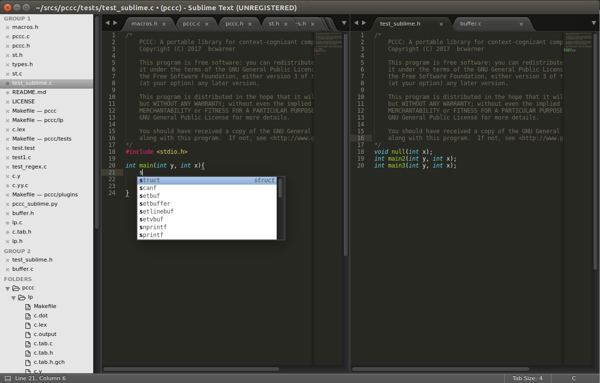
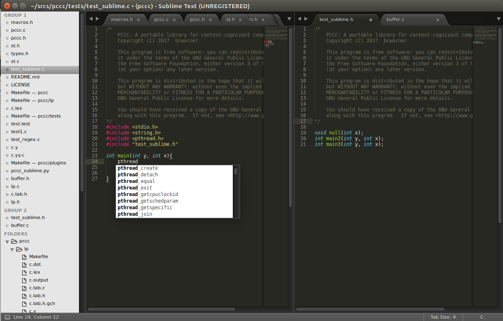
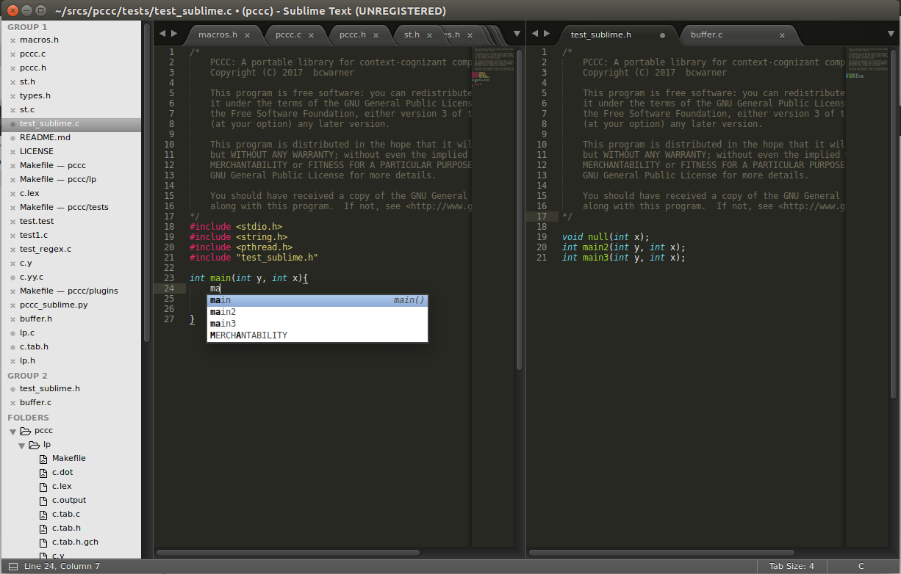

# Portable Context-Cognizant Completer

<<<<<<< HEAD
PCCC is an expandable library which can be used to supply a text editor's auto completer with more helpful suggestions based on the document being edited. For example, insertions into a C file containing a reference to stdio.h may show up with suggestions to symbols like `size\_t`. Suggestions will come up based on the contents of the files being referenced. 
=======
PCCC is an expanable library which can be used to power a text editor's auto completer and provide more helpful suggestions based on the document being edited. For example, insertions into a C file containing a reference to stdio.h may show up with suggestions to symbols like `size\_t`. PCCC is written in C, and the lexer/parsers it uses are written in Flex and Bison. A plugin is available for Sublime Text in the repository. PCCC is licensed under the GPLv3, and the project is currently in its *very early* alpha stage.
>>>>>>> 2a727a6b70171f3f8e3f963d978f0ca82e9d4e46

PCCC is written in C, and the lexers and parsers it uses are written in Flex and Bison. You can implement PCCC into your program if you are using Linux and have `make`, `gcc`, `bison`, and `flex` installed on your system. You can also use the included Sublime Text plugin if you have those prerequisites and have Sublime Text installed.

PCCC is licensed under the GPLv3, and the project is currently in its alpha stage.

## General Usage

To install this library and use the default Sublime Text plugin, you will need to use `make` using the `release` target. If we were to open up a new file and save it with a file name ending in `.c` and include `stdio.h`, then we should get:



Here's another example with the `pthread.h` header included:



We can also include local files and PCCC will recognize them.




## Programming Usage
You can find an example of how this library works in plugins/pccc\_sublime.py.

We first start off by creating a _context_. This will primarily keep track of the symbols and buffers in use

```
#include "pccc/types.h"
#include "pccc/pccc.h"

pccc_init(NULL, 0); // The arguments are an array of pccc_buffer *, and an int giving the length of the array.
```

Next, you need to add buffers that the text editor is using so the library can keep track of it and analyze it for you. You can do this by calling:
```

pccc_buffer *buf = pccc_add_new_buffer(ctxt, fn, buf, buflen, PCCC_BUFFER_DYNAMIC);
```
This tells the given context, `ctxt`, that a buffer with file name (this needs to be the absolute path), `fn`, has the contents `buf` of size `buflen`, and that it will have a flag stating that it will be edited several times.

Next, you need to analyze it.
```
pccc_analyze(ctxt, buf);
```
It will parse the buffer with the appropriate lexer/parser based upon the extension.

Finally, to get suggestions, call:
```
pccc_suggestions *sug = pccc_suggest_prefix(ctxt, "prefix");
```
The result will return a pointer to a structure containing an array, `suggestions`, of char \*, and an int N of the number of suggestions returned. 


## Contributing
Contributions will significantly improve the capabilities and stability of PCCC, which will increase yours and others productivity. If you want to contribute, there are several things you can do:
- Fix memory issues, and make it more efficient.
- Add or improve support for another language.
- Fix bugs.
- Improve thread-safety.
- Add support for another text editor.

I will probably not be working on this project that much since I will be extremely busy with school this year.

Special thanks to Dr. Morrissey and Dr. Jones at Portland State University for giving me advice on this project.
